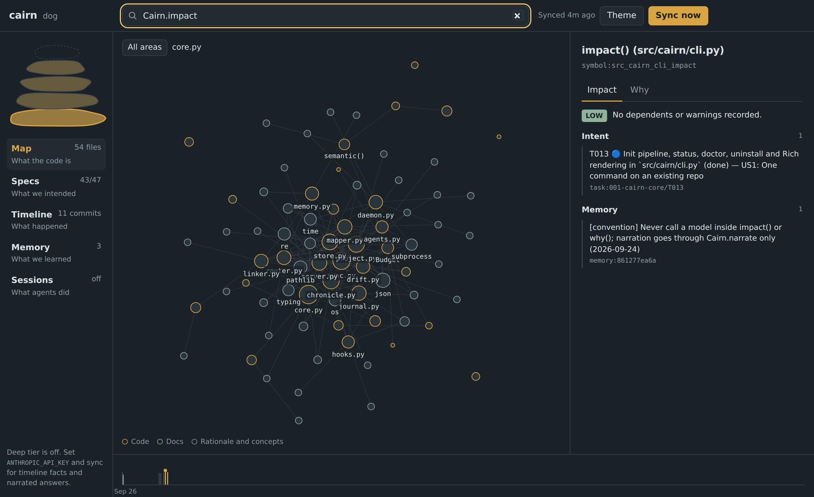
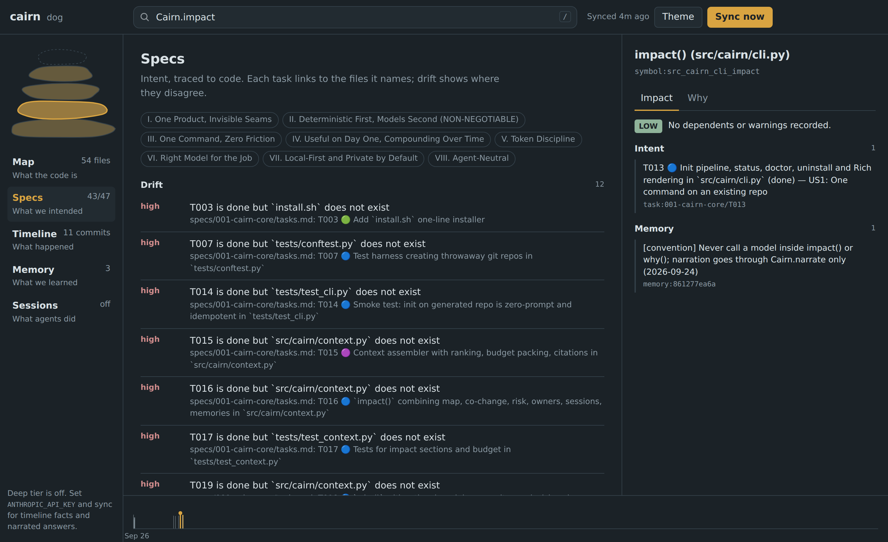
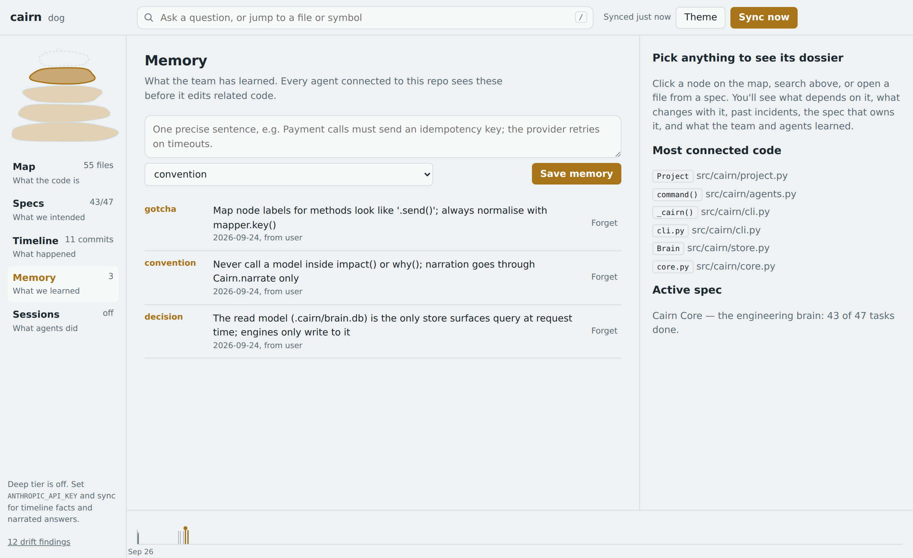

# Cairn

**Institutional memory for coding agents.** Run one command in any repository. Your agents (and you)
get a map of the code, the intent behind it, what happened to it, what the team learned, and what
previous agent sessions did, all behind one CLI, one MCP server and one page.

```sh
curl -fsSL https://raw.githubusercontent.com/cairn-dev/cairn/main/install.sh | sh
cd your-repo && cairn
```



## Why

Coding agents are sharp but amnesic. Every session they re-read the same files, miss the caller
three hops away, re-introduce the bug that was reverted last spring, and never hear about the
convention the team agreed on in review. Cairn gives them the context a senior engineer carries
around, and it gets better with every commit, spec and session.

| Layer | Answers | Built from |
|---|---|---|
| **Map** | What is the code? | ASTs of 30+ languages, docs, schemas, rationale comments (local, no model) |
| **Specs** | What did we intend? | The spec-driven workflow: constitution, spec, plan, tasks |
| **Timeline** | What happened? | Git history, co-change, fixes and reverts; temporal facts in the deep tier |
| **Memory** | What did we learn? | Conventions, decisions and gotchas recorded by people and agents |
| **Sessions** | What did agents do? | Automatic capture of agent sessions: files read, changed and learned |

## What you get on day one (no API key)

- `cairn impact <file|symbol>`: dependents, tests likely affected, files that usually change
  together, past fixes and reverts, the spec task that owns it, conventions, recent agent work,
  and a risk level.
- `cairn why <file|symbol>`: rationale comments, the commits that wrote those lines, the requirement
  and task behind it, recorded decisions.
- `cairn drift`: done tasks whose files are missing, requirements nothing implements, code that
  changed after its task was closed.
- Every agent is wired in: Claude Code, Codex, Cursor, Gemini CLI and VS Code get the `cairn` MCP
  server and instructions. Claude Code also gets a status line, a session-start briefing,
  `/cairn:*` commands and model-tiered sub-agents.
- The spec workflow gains hooks. Before planning, the plan is grounded in real impact and history.
  After tasks, tasks are traced to code. After implementing, drift is checked and learnings saved.
- `cairn ui` opens one page with all of it.

## And over time

Every commit re-syncs in the background (git hooks). Sessions accumulate. Memories compound. With
`ANTHROPIC_API_KEY` set, the deep tier adds a temporal fact graph ("true from March until the May
refactor"), semantic memory with dedupe and updates, narrated answers (`--explain`, `cairn ask`)
and semantic drift checks. Each job is routed to the cheapest model that does it well.

| Tier | Default model | Jobs |
|---|---|---|
| fast | Claude Haiku 4.5 | classification, labels, summaries at volume |
| balanced | Claude Sonnet 5 | fact extraction, memory updates, linking tie-breaks |
| deep | Claude Opus 5.5 | why, impact and drift synthesis, `ask` |
| frontier | Claude Fable 5.1 | opt-in whole-system reviews only |

Budgets, prompt caching and a cost ledger (`cairn models --ledger`) are built in.

## The terminal

```text
▲ cairn  payments-service  synced 2m ago
  Map        ██████████░░  1,204 files · 18,450 nodes · 212 areas
  Specs      ████░░░░░░░░  3 features · 41/96 tasks
  Timeline   ████████░░░░  3,000 commits · 57 warnings
  Memory     ██░░░░░░░░░░  24 memories
  Sessions   ██████░░░░░░  812 observations
Active spec 003 41/96 tasks   2 drift findings → cairn drift   UI http://127.0.0.1:4747
```

| Specs, traced to code | Team memory (light theme) |
|---|---|
|  |  |

## Commands

| | |
|---|---|
| `cairn` | Set up (first run) or show status |
| `cairn impact <target>` / `cairn why <target>` | The two questions that matter before an edit |
| `cairn ask "<question>"` | Evidence pack, plus a narrated answer when a key is set |
| `cairn remember "<text>" --kind convention` / `cairn recall <q>` | Team memory |
| `cairn specs [id]` / `cairn drift [id]` | Intent, traced to code, and where it drifted |
| `cairn timeline` / `cairn sessions` | What happened, and what agents did |
| `cairn trace path A B` / `cairn hubs` / `cairn areas` | Explore the map |
| `cairn ui` / `cairn doctor` / `cairn models --ledger` | Page, health, cost |

Full reference: [docs/cli.md](docs/cli.md). Agent tools: [docs/mcp.md](docs/mcp.md).

## Install options

```sh
uv tool install cairn-brain              # or: pipx install cairn-brain
uv tool install 'cairn-brain[deep]'      # + temporal facts, semantic memory, local embeddings
```

Requirements: Python 3.11+ and git. Node.js 18+ enables session capture. Nothing leaves your
machine unless you configure a model provider.

## Documentation

[Architecture](docs/architecture.md) · [CLI](docs/cli.md) · [MCP tools](docs/mcp.md) ·
[Agents](docs/agents.md) · [Configuration](docs/configuration.md) ·
[Models and cost](docs/models-and-cost.md) · [Decisions (ADRs)](docs/adr/) ·
[Contributing](CONTRIBUTING.md)

This project is itself built spec-first. Its constitution, spec, plan and tasks are in
[`.specify/`](.specify/memory/constitution.md) and [`specs/001-cairn-core`](specs/001-cairn-core/spec.md).

## Licence

Apache-2.0. Cairn builds on excellent open-source projects; see
[THIRD_PARTY_NOTICES.md](THIRD_PARTY_NOTICES.md).
