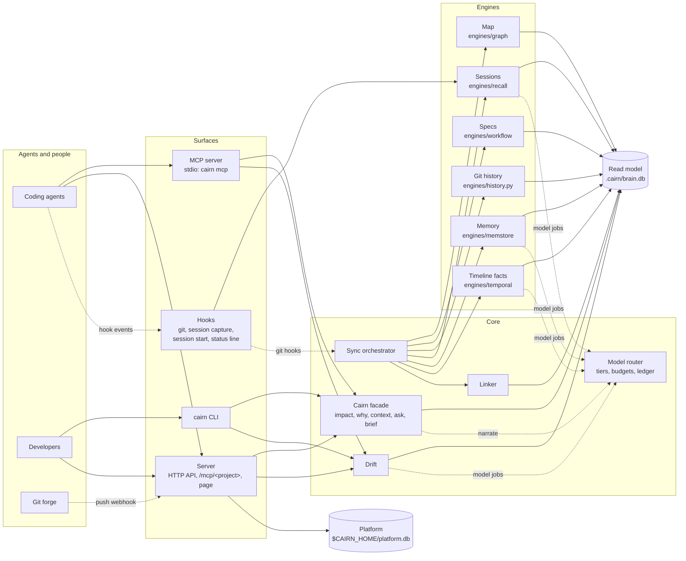

# Architecture

Cairn is one Python package (`src/cairn/`). Five engines write to their own stores. Sync mirrors
their output into one SQLite read model, and every surface reads from it: the CLI, the MCP server,
the HTTP API and the page. One model layer serves every engine, and one server serves every
project. The decisions behind this shape are in [the ADRs](adr/).

## Engines and stores

Each engine lives in `src/cairn/engines/`. Most have a thin adapter module next to them that
mirrors their output into the read model.

| Layer | Engine | Adapter | Store | Model use |
|---|---|---|---|---|
| Map | `engines/graph/` | `engines/mapper.py` | `.cairn/graph/` (`graph.json`, `GRAPH_REPORT.md`, `graph.html`, `manifest.json`, `fingerprint.json`, cache, `wiki/`) | None for code (tree-sitter ASTs). Document, paper and image extraction and community naming use a model. |
| Specs | `engines/workflow/` | `engines/specs.py` | `.cairn/workflow/` (constitution, templates, scripts, integrations, extensions, presets, workflows) and `specs/NNN-name/` | None in Cairn itself. Your agent runs the `/cairn.*` commands in its own session. |
| Timeline (git) | `engines/history.py` | — | the read model (`events`, `cochange`, `filestats`) | None |
| Timeline (facts) | `engines/temporal/` | `engines/chronicle.py` | `.cairn/temporal/graph.kuzu`, or Neo4j, FalkorDB or Neptune | Extraction, deduplication and summaries |
| Memory | `engines/memstore/` | `engines/memory.py` | `.cairn/memstore/` (vector index, `history.db`, `seeds.db`), or Qdrant, pgvector or Chroma | Reconciliation (ADD, UPDATE, DELETE or NONE), optional reranking |
| Sessions | `engines/recall/` and `capture.py` | `engines/journal.py` | `.cairn/sessions.db`, `.cairn/recall/` (vectors, worker lock and log) | Observations and summaries (deterministic records without a model) |

`engines/vectors.py` gives every engine the same local embeddings (BAAI/bge-small-en-v1.5, 384
dimensions, ONNX, cached under `$CAIRN_HOME/models`) and the same on-disk vector index, backed by
faiss when it's installed and by numpy otherwise. When the embedding model can't load, a
deterministic hashing embedder takes over.

## The read model

`.cairn/brain.db` is one SQLite file in WAL mode ([ADR-0001](adr/0001-unified-read-model.md)).
Queries against it are dictionary and index lookups, so they work offline and never need a model.
You can delete the file and rebuild it by running `cairn sync`.

| Table | Holds |
|---|---|
| `entities` | Everything addressable: `file`, `symbol`, `rationale`, `spec`, `story`, `req`, `task`, `commit`, `session`, `obs`, `fact` |
| `links` | Typed, directed relations with provenance (`EXTRACTED` or `INFERRED`), confidence and source, such as `defined_in`, `owns`, `implements`, `mentions`, `touches`, `reads`, `modifies`, `part_of` and `cites` |
| `events` | The timeline: commits, spec changes, workflow runs, sessions, memories, facts and drift |
| `memories` | Durable knowledge with kind, scope, source, supersession and the memory engine's id |
| `cochange`, `filestats` | Files that change together; commit, risk and author counts per file |
| `ledger` | Every model call: task, tier, model, input, output and cache tokens, success |
| `queries` | Every context pack handed to a reader, with its size and the size of the files it cites |
| `kv` | Cursors and digests that keep sync incremental |
| `fts` | FTS5 full-text search across every layer, with identifiers split (`processPayment` matches "process payment") |

Canonical ids are `kind:key`: `file:src/pay.py`, `symbol:<map id>`, `spec:001-name`,
`story:001-name/US1`, `req:001-name/FR-001`, `task:001-name/T004`, `commit:<sha>`,
`session:<id>`, `obs:<id>`, `memory:<id>`, `fact:<uuid>`. Citations in every answer use them.

## Sync

`cairn sync` (`src/cairn/sync.py`) runs the same steps each time. Git hooks start it in the
background after commit, merge, checkout and rewrite. A file lock (`.cairn/sync.lock`) serialises
syncs, so a second one exits at once.

1. **Fan-out, in parallel:**
   - map: compares every file git knows about (size and modification time) with the fingerprint
     from the last build. If nothing changed, it skips the build. If up to 150 files changed and
     none were removed, only those are re-extracted. Otherwise it runs one incremental tree-sitter
     pass. The result is mirrored into the read model. Paths in `.cairn/graphignore` are skipped;
     by default that's agent tool folders and generated or vendored code (`*.min.js`, `vendor/`,
     `node_modules/`, `dist/` and so on).
   - git history: new commits since the cursor, co-change pairs and risk tags (fix, revert, incident and so on)
   - specs: features, stories, requirements and tasks, skipped when the digest is unchanged
   - sessions: observations and summaries inserted since the last sync
2. **Memory:** seeds memory from ADRs, answered clarifications, contributing and style docs, and
   reverted or explained fixes. An edited source updates its memory and a deleted source retires it.
3. **Links:** links memories and facts to the files and symbols they mention (`INFERRED`).
4. **Drift:** runs the deterministic checks and stores the findings. Medium and high findings also
   go on the timeline.
5. **Timeline facts**, when a model is available and `[deep] enabled` allows it: builds one episode
   per day of activity (commits, spec progress, sessions, decisions) and extracts facts under the
   `[deep] budget_tokens` budget. Facts are mirrored into the read model. Unfinished work resumes on
   the next sync.

One step failing never blocks the others. Each step's result is shown by `cairn sync` and streamed
to the page.

## Answers: context packs

`src/cairn/core.py` turns impact, why, context and ask into a **pack**: items grouped in sections,
each with a relevance score and a citation. Rendering fits a token budget in two passes. The first
pass takes the top two items of every section for breadth, and the second fills the rest by score.
Truncated sections say `(+N more)`. Evidence carries a tag: `EXTRACTED` means read from a source,
and `INFERRED` means derived. Only narration (`--explain`, `ask`) calls a model
([ADR-0002](adr/0002-deterministic-first.md)).

When a pack reaches a reader, Cairn logs a row in `queries`: the surface, the kind, the target, the
tokens sent and the estimated tokens of the repository files the evidence came from. The page's
own views aren't counted. See [how savings are measured](models-and-cost.md#how-savings-are-measured).

## Server and hub

One server process serves every project ([ADR-0007](adr/0007-one-server-many-projects.md)):

- `src/cairn/daemon.py` starts it in the background (`cairn ui`, `cairn up`) and stops it
  (`cairn down`). It keeps its state in `$CAIRN_HOME/server.json`. Each repository you open is
  registered with the platform and reuses the same server and port.
- `src/cairn/server.py` is the FastAPI app. `Hub` keeps one `Cairn` object per project, runs syncs
  and broadcasts progress over a server-sent event stream. Project routes live under
  `/api/p/<project id>/` and check the caller's role on that project: they answer 404 when the
  project isn't visible and 403 when the role is too low. OpenAPI docs are served at `/api/docs`.
  `POST /api/p/<id>/narrate` streams a model's explanation of a question, an impact or a why as
  it's written, one JSON event per line; closing the connection stops the model call.
  `GET /api/repos/map` is the cross-repository map: every repository the caller can read and the
  imports that link them, built from the maps that already exist.
- `/mcp/<project id>/` serves the same MCP tools over streamable HTTP for agents on other machines.
  Callers whose role or token can't write get the read-only tool set.
- `/` serves the page (`src/cairn/ui/`): a Preact app with no build step and every library vendored.
  Its views are Overview, Impact, Map, Specs, Sessions, Timeline, Memory and Project settings, plus
  team pages (Members, API tokens, Projects, Audit log, Settings), server users and your account.

## Platform

`src/cairn/platform/` holds users, teams, roles, invitations, API tokens, web sessions, projects,
webhooks and the audit log. They're stored in `$CAIRN_HOME/platform.db`, separate from project data.

- **Local mode** (the default) binds to loopback. It has no sign-in: every request acts as the
  local owner, who has a "Personal" team.
- **Team mode** (`cairn serve --team` or `mode = "team"`) requires a session cookie or a bearer
  token. Roles are owner, admin, member and viewer, with per-project overrides. Git projects are
  cloned under `$CAIRN_HOME/repos` and re-synced by push webhooks.

Authorisation is enforced in the service layer, not only at the HTTP edge. See [teams](teams.md).

## MCP

`src/cairn/mcp_server.py` exposes a compact core set of tools by default
([ADR-0008](adr/0008-compact-agent-tools.md)). Setting `[mcp] tools = "all"` adds every map,
timeline-fact and session operation. Graph and timeline tools are generated from the engines' own
tool specs. See [MCP tools](mcp.md).

## Model layer

Every model call goes through `src/cairn/router.py` ([ADR-0004](adr/0004-model-routing.md)). The
supported providers are `anthropic`, `openai` (any OpenAI-compatible endpoint) and `claude-code`
(the signed-in CLI), with `auto` picking the first that works. Each job maps to a tier. Syncs run
under a budget, and every call lands in the ledger. The engines don't call a provider SDK directly.
They use router-backed clients instead. See [models and cost](models-and-cost.md).
