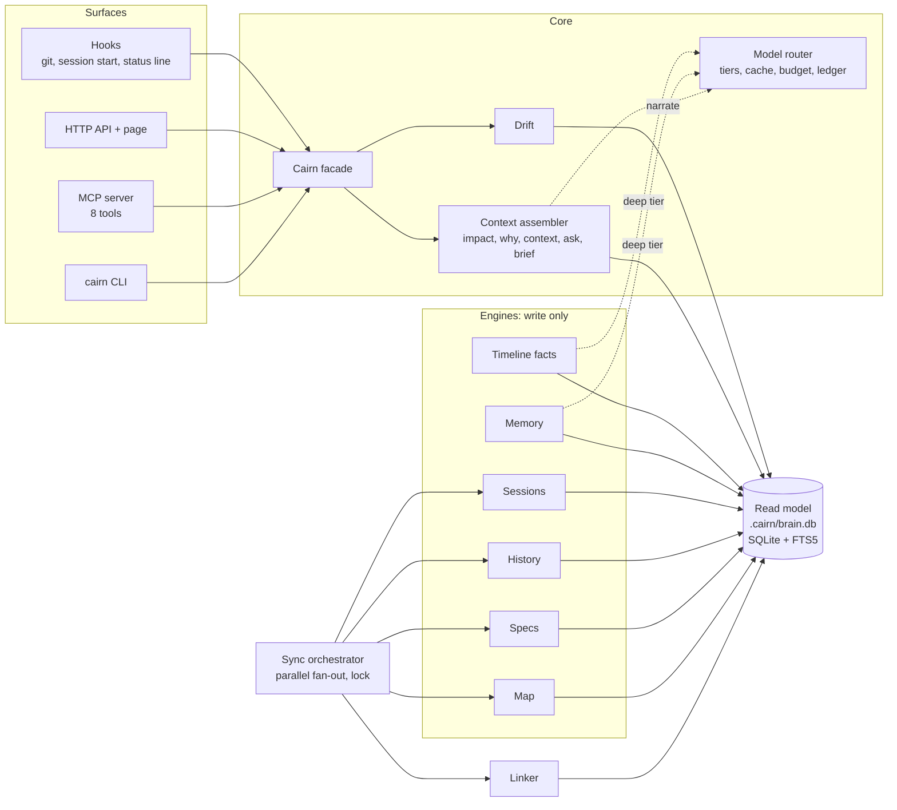

# Architecture

## Shape

## Principles in code

- **One read model.** Engines write; every surface reads `.cairn/brain.db`. Queries are dictionary
  and index lookups (impact in ~3 ms on a 2k-node map), uniform across layers and offline
  ([ADR-0001](adr/0001-unified-read-model.md)).
- **Deterministic first.** Impact, why, drift and context are computed from ASTs, git, spec
  artifacts and session logs. Models only narrate or run the deep tier
  ([ADR-0002](adr/0002-deterministic-first.md)).
- **Invisible seams.** Engines live behind `cairn/engines/*` adapters; users and agents only see the
  five layers ([ADR-0005](adr/0005-invisible-engines.md)).

## Data flow of a sync

1. Four engines run in parallel threads: map build (incremental AST), git history since the cursor,
   spec artifacts (skipped when their digest is unchanged), and session observations since the id cursor.
2. The linker mirrors map files and symbols into the read model and links memories and facts to
   the code they mention.
3. Deterministic drift checks run and are recorded.
4. Deep tier (when enabled): daily episodes go to the temporal fact graph under a token budget;
   facts are mirrored back. Unfinished work resumes on the next sync.

A file lock serialises syncs; git hooks start them in the background so commits never wait.

## The context assembler

Each answer is a **pack**: items with a section, a relevance score, and a citation (`[kind:key]`).
Rendering is budget-aware: pass 1 takes the top two items of every section (breadth), pass 2 fills by
score (depth), and truncated sections say `(+N more)`. Budgets are hard limits, which the test suite
checks. Evidence is tagged `EXTRACTED` (read from a source) or `INFERRED` (derived) so agents
know what to verify.

## Canonical ids

`file:path` · `symbol:<map id>` · `spec:NNN-name` · `story:NNN/US1` · `req:NNN/FR-001` ·
`task:NNN/T001` · `commit:<sha>` · `session:<id>` · `obs:<id>` · `memory:<id>` · `fact:<uuid>`

See [data-model.md](../specs/001-cairn-core/data-model.md) for tables and link rules.
