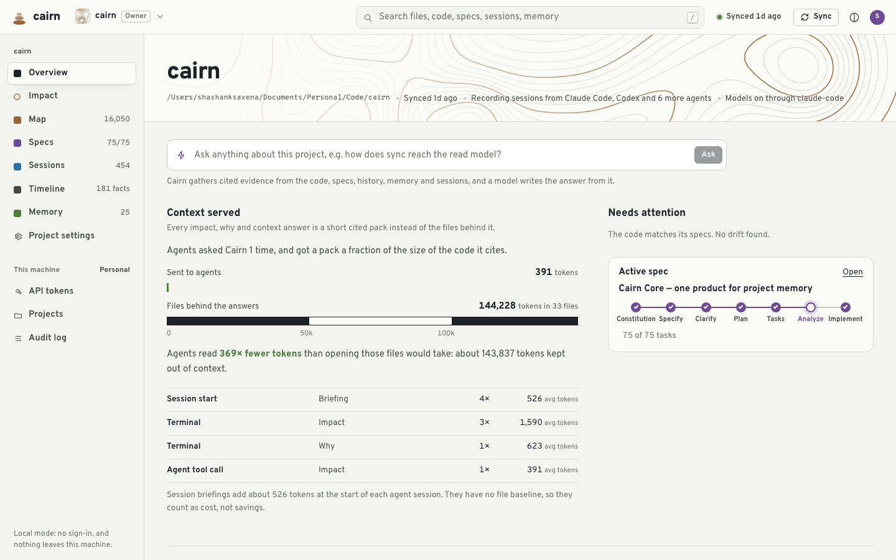
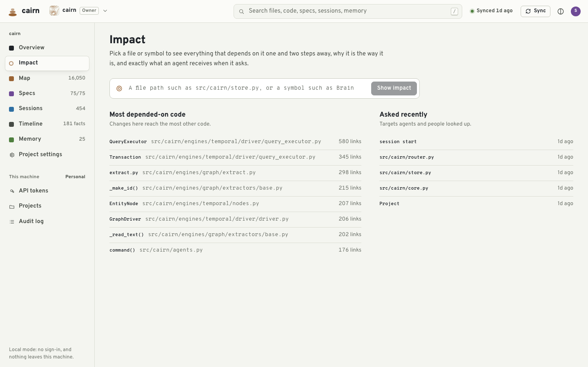
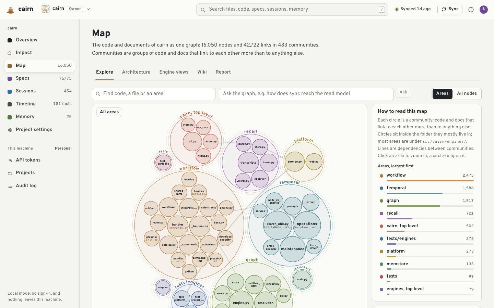
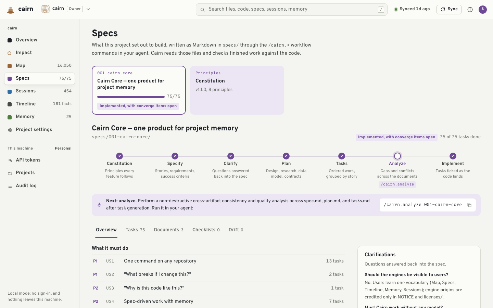
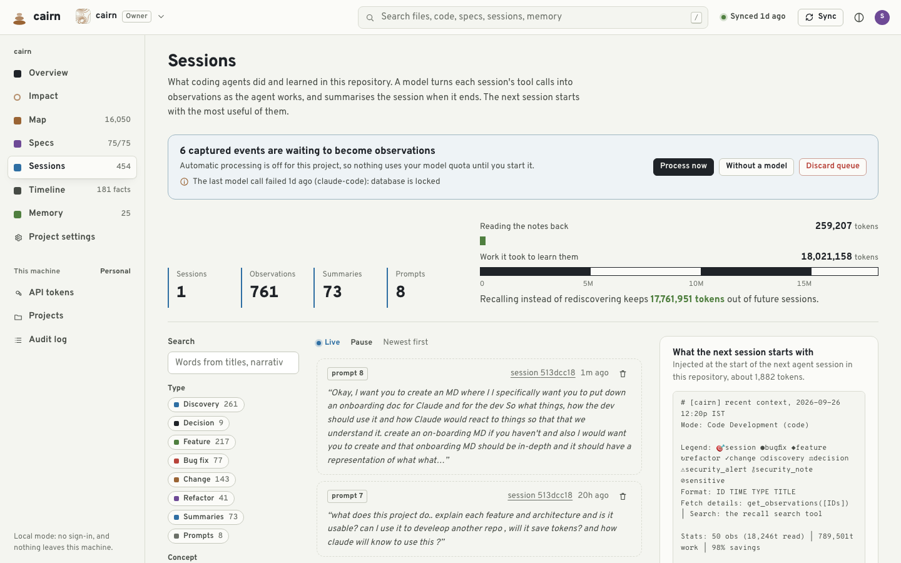
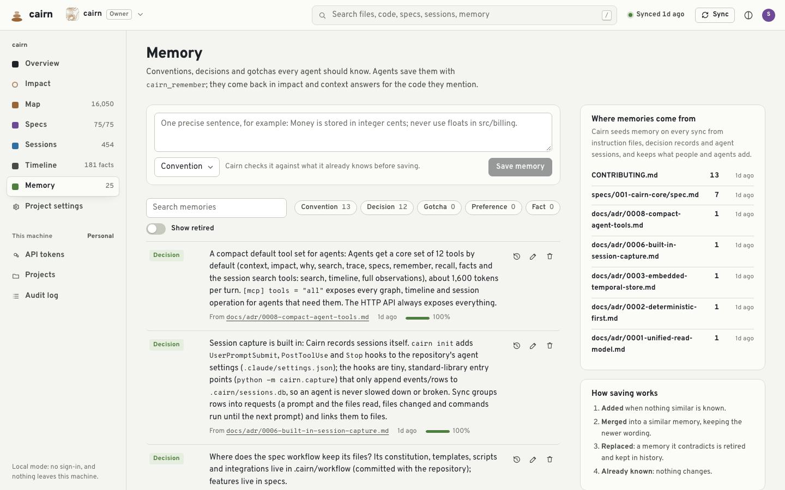
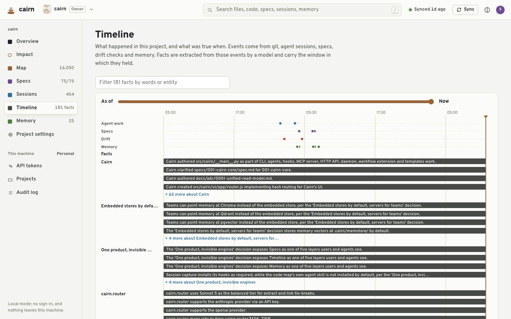

# Onboarding: Cairn for developers and for agents

This is the deep walkthrough. If you want the two-minute version, read the [README](../README.md)
first. This document answers three questions in depth: what a developer does with Cairn, what an
agent (Claude Code or otherwise) does with it automatically, and how you tell whether it's actually
working — with real screenshots from a running instance, not mockups.

Everything shown here was captured against this repository's own Cairn instance
(`http://127.0.0.1:4747`), the same one Cairn used to build itself.

## Contents

- [The two-minute mental model](#the-two-minute-mental-model)
- [For the developer: install, verify, use](#for-the-developer-install-verify-use)
- [For Claude (and every other agent): how it knows to use this](#for-claude-and-every-other-agent-how-it-knows-to-use-this)
- [The five engines, one at a time](#the-five-engines-one-at-a-time)
- [The UI, page by page](#the-ui-page-by-page)
- [Reading the savings numbers](#reading-the-savings-numbers)
- [Validating that it's working](#validating-that-its-working)
- [Personas: which parts are for you](#personas-which-parts-are-for-you)
- [Troubleshooting](#troubleshooting)

## The two-minute mental model

Cairn is one server process, per machine, that knows about every repository you've pointed it at.
For each repository it keeps a read model in `.cairn/` — a SQLite database, a code graph, a session
log — built by syncing the repository's git history, its code, its specs and its agents' sessions.
Agents (Claude Code, Codex, Cursor, Gemini CLI, and others) talk to it two ways:

1. **Automatically**, at the start of every session, through a hook that injects a short brief:
   recent work, active spec, team conventions.
2. **On demand**, through MCP tools (`cairn_context`, `cairn_impact`, `cairn_why`, `cairn_remember`,
   …) that the agent calls when it's about to touch code, when it wants to know why something is the
   way it is, or when it learns something worth keeping.

Both paths return a **cited, token-budgeted summary**, never a file dump. That's the whole point:
the agent gets what it needs to act correctly without reading — and paying for — everything that led
to that answer.

## For the developer: install, verify, use

```sh
cd your-repo
cairn                 # first run: sets everything up, no questions asked
```

That one command:

- builds the code map (tree-sitter, 25 languages built in);
- seeds memory from your ADRs, CONTRIBUTING.md, spec clarifications and git history;
- wires every agent CLI it finds on your machine to the `cairn` MCP server, with session-start
  injection where the agent supports it;
- installs git hooks that keep the map in sync in the background;
- starts the local server and opens the page.

Everything after that is either **look** (open the page, ask a question) or **verify** (run
`cairn doctor`, check a number matches what you expect). You are not expected to run Cairn commands
routinely — agents do that. Your day-to-day touchpoints are:

| You want to… | Do this |
|---|---|
| See if setup worked | `cairn doctor` |
| Check what an agent will get before you ask it to do something | Open **Impact**, type the file, read the pack |
| See what agents did while you were away | Open **Sessions** |
| Correct something an agent got wrong, once | Open **Memory**, add a convention/decision/gotcha |
| Check the code still matches the spec | Open **Specs**, look at Drift |
| See if this is worth the model spend | Open **Overview**, read "Context served" |
| Add a second repository | `cd other-repo && cairn` — it joins the same server |
| Turn this into a team server | `cairn team init`, `cairn serve --team`; see [teams](teams.md) |

## For Claude (and every other agent): how it knows to use this

There is no magic binding an agent to Cairn — it's the same mechanism as any MCP tool, plus one
unconditional injection point. `cairn init` does three concrete things per agent:

**1. It registers the MCP server.** For Claude Code that's an entry in `.mcp.json`:
```json
{"mcpServers": {"cairn": {"command": "cairn", "args": ["mcp"]}}}
```
That's what makes `cairn_context`, `cairn_impact`, `cairn_why`, `cairn_remember`, `cairn_recall`,
`cairn_search`, `cairn_trace`, `cairn_specs` and `cairn_facts` callable tools in the session.

**2. It writes an instructions block.** This is the actual block Cairn wrote into this repository's
own `CLAUDE.md`:

> ## Cairn — project memory
>
> This repository is connected to Cairn (MCP server `cairn`), the project's memory of code structure,
> specs, history, decisions and past agent work.
>
> - **Before editing**, call `cairn_context` with your task (or `cairn_impact` for a specific file or
>   symbol). It returns dependents, files that usually change together, past fixes and reverts, the
>   owning spec task, team conventions and recent agent sessions, within a small token budget.
> - **When asked why code is the way it is**, call `cairn_why` before guessing.
> - **When you learn something durable** (a convention, decision, gotcha), call `cairn_remember`
>   with a one-sentence statement and a kind. Don't store what the code already says.
> - Treat `[EXTRACTED]` evidence as fact and `[INFERRED]` as a lead to verify.
> - Spec work lives in `specs/`; Cairn hooks run automatically at plan, tasks and implement stages.

This is an instruction, not an enforcement mechanism — the same as any line in `AGENTS.md` or
`CLAUDE.md`. An agent that ignores its instructions can still ignore this one. What raises the odds
it doesn't is point 3.

**3. It injects context whether the agent asks or not.** A `SessionStart` hook (or the closest
equivalent per agent — a plugin system prompt for OpenCode, an untracked instructions file for
Copilot CLI, since it strips custom instruction files' unknown tags) runs before the agent sees your
first message, and prints a brief like the one shown live on the [Sessions page](#the-ui-page-by-page)
below. The agent doesn't have to decide to use Cairn for this part — it's already in context. Run
`cairn doctor` to see exactly which mechanism each agent on your machine got:

```
●  Claude Code memory     SessionStart hook · capture on
○  Codex memory           SessionStart hook · capture on · hooks not approved yet
●  Cursor memory          SessionStart hook · capture on
●  Gemini CLI memory      SessionStart hook · capture on
●  OpenCode memory        system prompt (plugin) · capture on
●  Copilot CLI memory     .github/instructions… (untracked) · capture on
●  Antigravity memory     .agents/rules/cairn-… (untracked) · capture off
```
(`○` here just means Codex needs a one-time approval in its own `/hooks` screen — nothing broken.)

**What this looks like from the agent's side, concretely:** the model gets a system-ish block of
~500–2,000 tokens at session start (map hubs, active spec, team conventions, recent sessions — see
the real 1,882-token example on the Sessions page), then, when it's about to edit something, it calls
`cairn_impact("src/cairn/router.py")` and gets back citations like `[symbol:src_cairn_core_cairn_init]`
and `[memory:b16b87e3db]` instead of opening every file that imports that module.

## The five engines, one at a time

Cairn ships as one product, but it does five distinct jobs. Each has a CLI surface, an MCP tool
surface, and a UI page.

### 1. Map — "what is the code?"

Built from tree-sitter parses of your code (plus docs, schemas and rationale comments), kept as a
graph: files, symbols, imports, calls, and — for related repositories — cross-repo import edges.

- **Dev**: `cairn graph`, `cairn hubs`, `cairn areas`, `cairn trace path A B`. Or just open **Map** —
  it opens on the biggest *communities* (groups of code that link to each other more than to anything
  else), not a hairball of every node, so a newcomer can see the shape of a 16,000-node codebase in
  one screen.
- **Agent**: `cairn_impact(target, depth)` — dependents, tests likely affected, files that usually
  change together, all cited.
- **Real number from this repo**: 16,050 nodes, 42,722 links, 483 communities, the largest being
  `workflow` (2,475 nodes).

### 2. Specs — "what did we intend?"

The spec-driven workflow: constitution → specify → clarify → plan → tasks → analyze → implement,
written as Markdown in `specs/`, driven by `/cairn.*` commands in your agent.

- **Dev**: open **Specs** to see task progress and drift (code that no longer matches what a task
  said it would do). `cairn drift` from the CLI.
- **Agent**: `cairn_specs()` for the active feature's requirements and open tasks; the workflow
  commands (`/cairn.plan`, `/cairn.tasks`, `/cairn.implement`) read and write these files directly.
- **Real number from this repo**: feature `001-cairn-core`, 75 of 75 tasks done, 0 drift findings.

### 3. Timeline — "what happened, and when was it true?"

A temporal fact graph built from git history, agent sessions, drift checks and memory changes. Unlike
the read model (which only knows the current state), timeline facts carry a validity window: "true
from March until the May refactor."

- **Dev**: open **Timeline**, drag the "as of" slider to see the project at any past moment.
- **Agent**: `cairn_facts(query, at=<date>)` — history-aware answers instead of just "what's true
  now."
- **Real number from this repo**: 181 facts extracted so far, at zero deep-tier token cost beyond the
  sync budget.

### 4. Memory — "what did we learn?"

Durable conventions, decisions, gotchas and preferences — from people, from agents, and seeded
automatically from ADRs, CONTRIBUTING.md and spec clarifications. Adding a memory doesn't just
append: Cairn checks it against what's already known and merges, updates or retires the overlapping
memory instead of duplicating it.

- **Dev**: type one precise sentence into **Memory** (e.g. "Money is stored in integer cents; never
  use floats in src/billing"), pick a kind, save. Edit or retire it later; history is kept.
- **Agent**: `cairn_remember(text, kind)` to save, `cairn_recall(query)` to search. The instruction
  block above tells the agent to do this after learning something durable — not after every action.
- **Real number from this repo**: 25 active memories, 13 seeded from CONTRIBUTING.md alone, 0 gotchas
  yet (a healthy young project).

### 5. Sessions — "what did agents do?"

Every coding session is captured — prompts, files read and changed, commands run — and (with a model,
or deterministically without one) turned into observations and a session summary. The next session
starts with the most useful of them, which is the injection mechanism described above.

- **Dev**: open **Sessions** to see the feed, search past work, or read what the next session will
  start with. This is also where you turn on or off automatic model processing
  (`[recall] worker_spawn`) and where you see if a background worker call failed.
- **Agent**: this happens to it, not through it — capture is hooks, not a tool the agent calls. It
  can search past sessions with `cairn_session_search`.
- **Real number from this repo**: 1 active session logged 454 rows of raw activity → 761 observations
  and 73 summaries after processing; the next session starts with about 1,882 tokens of that,
  instead of re-reading the 18M+ tokens of raw work it came from.

## The UI, page by page

### Overview — the health check and the ROI number



This is what a developer or a team lead opens first. Three things to read:

- **"Context served"** — the actual token-savings measurement (see below).
- **"Needs attention"** — the active spec's progress and any drift findings, so you know if the code
  and the plan have diverged.
- The **Ask box** at the top — type a question about the codebase, get a cited, streamed answer from
  a model, backed by the same evidence pack an agent would get.

### Impact — the pre-edit checklist



Type a file or symbol, get: how many other files depend on it, which tests are likely affected, which
files usually change with it, and the exact pack an agent would receive if it asked the same
question. This page exists so a human can sanity-check what an agent is about to be told before
trusting it with a change.

### Map — the architecture at a glance



Opens on **Areas**: the largest communities, packed inside the folder they mostly live in, with
dependency lines between them. Click an area to zoom in; click a circle to open its members. This is
deliberately not a force-directed hairball — the goal is that someone who has never seen the
repository can look at this screen and understand how it's organized.

### Specs — intent traced to code



The active feature, its progress stepper (constitution → specify → clarify → plan → tasks → analyze →
implement), its task board, and any clarifications the spec workflow captured. The "Next" banner
tells you (and your agent) exactly which slash command to run next.

### Sessions — what agents actually did



The feed of captured work, search across it, and — on the right — the exact text the next agent
session will be given at start-up. This is the page to check if you're wondering "did my agent
actually remember the thing I told it yesterday."

### Memory — the team's durable knowledge



Add a memory in one box, browse existing ones by kind, and see exactly which file or spec section
each seeded memory came from. "How saving works" on the right explains the four outcomes (added,
merged, replaced, already known) so it's clear this isn't just a growing list.

### Timeline — history with validity windows



Drag the "as of" slider to any point in the project's history; the fact list updates to show what was
true then, not just what's true now.

## Reading the savings numbers

Cairn measures its own value, and the number is visible on the Overview and Impact pages, not
claimed in a README. Concretely, from this repository right now:

- **Impact page**: asking about `src/cairn/router.py` sent an agent **391 tokens**, summarizing
  144,228 tokens of source across 33 files — **369× fewer tokens** than opening those files.
- **Sessions page**: 454 rows of raw captured activity, worth an estimated 18,021,158 tokens if an
  agent had to re-read it, condensed into 259,207 tokens of observations and summaries —
  **17,761,951 tokens kept out of future sessions**.
- The breakdown table on Overview shows *where* the savings come from: session-start briefings
  average 526 tokens (4 calls so far), terminal `Impact` calls average 1,590 tokens (3 calls), and so
  on — so you can see which surface is doing the work.

This number is per-project and grows as the project is used — a brand-new `cairn init` on an empty
history won't show much yet, because there's nothing to have saved reading.

## Validating that it's working

In order of how quickly each one tells you something:

1. **`cairn doctor`** — one command, everything at a glance: map size, whether git history and specs
   are wired, session capture status, which model Cairn found, and per-agent memory injection status.
   A `○` next to an agent usually means a one-time manual step (like Codex's hook approval), not a
   bug — the "Fix" column says what to do.
2. **Open Sessions → "What the next session starts with"** — if this box is empty or stale, agents
   aren't getting the injection. Check the agent's row in `cairn doctor` first.
3. **Ask something on Overview and check the citations resolve** — click a `[file:…]` or `[symbol:…]`
   citation; it should jump straight to that code in the Map.
4. **`cairn memory check`** — validates that every active memory's search record actually matches its
   stored text (this matters if you ever see a memory's text change unexpectedly; it repairs the
   mismatch with `--fix`).
5. **Toggle a task on the Specs page, reload** — if it doesn't stick, the write path to `tasks.md`
   isn't working; this should never happen, but it's a fast trust check.
6. **Sync and watch it complete** — the Sync button in the top bar shows live progress per layer
   (map, history, specs, sessions, memory, links, drift, and optionally timeline facts). A step that
   fails shows red with its actual error, not a silent "done."

## Personas: which parts are for you

**Solo developer, one repository.** Run `cairn` once. Use the page occasionally to sanity-check
Impact before a risky change, and to add a memory when you correct an agent's mistake so it doesn't
happen twice. You'll never need `cairn team …` or the platform pages.

**Tech lead / team admin.** Run `cairn team init`, `cairn serve --team` behind your reverse proxy,
`cairn project add <git url>` for each repository, `cairn team invite` for each teammate. You get
roles (owner/admin/member/viewer), an audit log of every memory, task, sync and settings change, and
per-project settings some of which (model provider, base URL) you can lock server-wide. See
[teams](teams.md) for the full deployment guide.

**Team member.** You get read/write on memory, sessions and sync for the projects your role allows.
Settings and team administration are locked to admins — the page disables what you can't use rather
than letting you find out by failing.

**The agent itself (Claude Code, Codex, Cursor, Gemini CLI, OpenCode, Copilot CLI…).** You don't do
anything to "use" Cairn beyond what `cairn init` already wired: read the session-start brief you're
given, call `cairn_context`/`cairn_impact` before an edit, call `cairn_why` before guessing at intent,
call `cairn_remember` when you learn something durable that isn't already in the code or docs. Don't
call `cairn_remember` for things the code already states — that's noise, not memory.

## Troubleshooting

- **`cairn: command not found`** — it's installed in a project's own environment, not globally.
  Either `uv tool install --python 3.12 cairn-brain` for a system-wide install (the pin is
  for kuzu wheels), or run
  it as `./.venv/bin/cairn` from this checkout.
- **An agent isn't getting context** — check `cairn doctor`'s per-agent row first. Most gaps are a
  one-time step the agent's own security model requires (Codex's `/hooks` approval), not a Cairn bug.
- **Session processing shows a failed model call** — the Sessions page's queue banner shows the
  actual error (quota, sign-in, a locked database). "Without a model" processes the queue
  deterministically at zero cost if you don't want to spend quota on it right now.
- **Numbers look stale** — press Sync. The rail and Overview counts update after the next sync
  completes, not instantly on every write.

---

See also: [README](../README.md) · [Architecture](architecture.md) · [CLI reference](cli.md) ·
[MCP tools](mcp.md) · [Agents](agents.md) · [Configuration](configuration.md) ·
[Models and cost](models-and-cost.md) · [Teams](teams.md)
