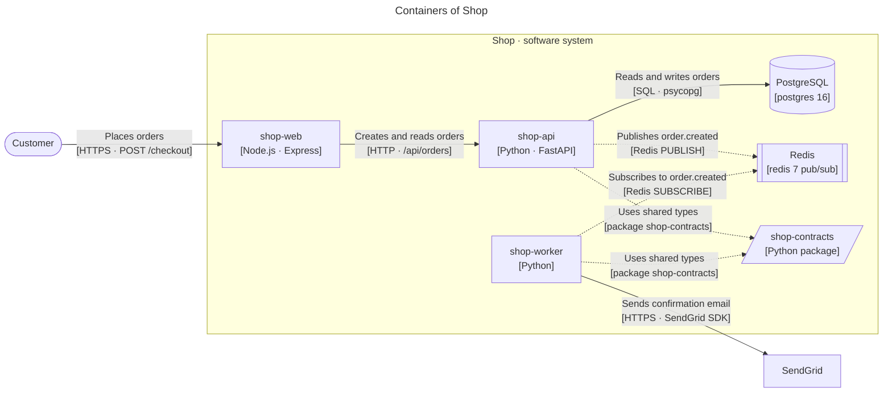
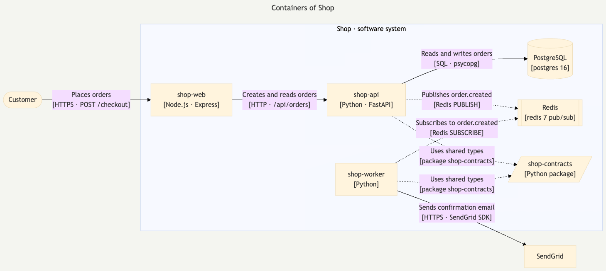
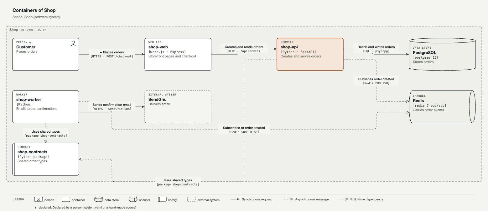
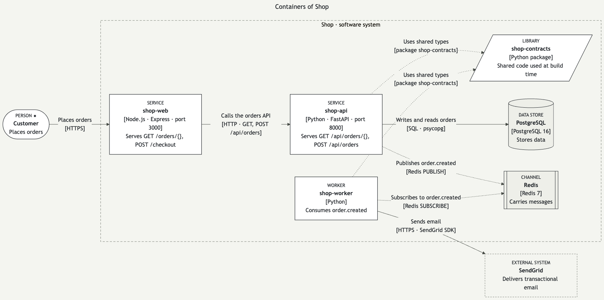

# YAML or Mermaid? One diagram, written both ways

The same Containers view of the sandbox "Shop" product, written by hand in each format. Both convert to the
same model and both pass the standard's checker. Judge by reading and by the pictures.

## 1. Written in YAML (Cairn's canonical format)

25 lines ([file](../../../docs/diagram-standard/examples/02-containers-shop.yaml)):

```yaml
diagram: container
title: Containers of Shop
scope: Shop (software system)
description: The storefront calls the orders API over HTTP; the API stores orders in PostgreSQL and publishes order.created on Redis, which the worker consumes to email the customer through SendGrid.
source_note: replaces the layered "High-Level Architecture" template
elements:
  - {id: customer, name: Customer, type: person, desc: Places orders, at: [0,0], provenance: declared, evidence: ["system.yaml: actors"]}
  - {id: web, name: shop-web, type: container, kind: web-app, tech: Node.js · Express, desc: Storefront pages and checkout, at: [1,0], evidence: ["shop-web/package.json", "shop-web/Dockerfile: EXPOSE 3000"]}
  - {id: api, name: shop-api, type: container, kind: service, tech: Python · FastAPI, desc: Creates and serves orders, at: [2,0], focus: true, evidence: ["shop-api/pyproject.toml: [project.scripts]", "shop-api/Dockerfile: EXPOSE 8000"]}
  - {id: db, name: PostgreSQL, type: data-store, tech: postgres 16, desc: Stores orders, at: [3,0], evidence: ["shop-api/docker-compose.yml: db image postgres:16", "shop-api/shop_api/db.py:2"]}
  - {id: redis, name: Redis, type: channel, tech: redis 7 pub/sub, desc: Carries order events, at: [3,1], evidence: ["shop-api/docker-compose.yml: redis image redis:7"]}
  - {id: worker, name: shop-worker, type: container, kind: worker, tech: Python, desc: Emails order confirmations, at: [2,1], evidence: ["shop-worker/pyproject.toml: [project.scripts]", "shop-worker/Dockerfile"]}
  - {id: sendgrid, name: SendGrid, type: external-system, desc: Delivers email, at: [1,1], evidence: ["shop-worker/pyproject.toml: sendgrid"]}
  - {id: contracts, name: shop-contracts, type: library, tech: Python package, desc: Shared order types, at: [2,2], evidence: ["shop-contracts/pyproject.toml"]}
boundaries:
  - {id: shop, name: Shop, type: software system, contains: [web, api, db, redis, worker, contracts]}
relationships:
  - {from: customer, to: web, what: Places orders, how: "HTTPS · POST /checkout", style: sync, evidence: ["shop-web/server.js:5"]}
  - {from: web, to: api, what: Creates and reads orders, how: "HTTP · /api/orders", style: sync, evidence: ["shop-web/src/api.js:3", "shop-api/shop_api/orders.py:9"]}
  - {from: api, to: db, what: Reads and writes orders, how: SQL · psycopg, style: sync, evidence: ["shop-api/shop_api/db.py:7"]}
  - {from: api, to: redis, what: Publishes order.created, how: Redis PUBLISH, style: async, evidence: ["shop-api/shop_api/events.py:8"]}
  - {from: worker, to: redis, what: Subscribes to order.created, how: Redis SUBSCRIBE, style: async, evidence: ["shop-worker/shop_worker/main.py:10"]}
  - {from: api, to: contracts, what: Uses shared types, how: package shop-contracts, style: build, evidence: ["shop-api/shop_api/orders.py:2"]}
  - {from: worker, to: contracts, what: Uses shared types, how: package shop-contracts, style: build, evidence: ["shop-worker/shop_worker/main.py:3"]}
  - {from: worker, to: sendgrid, what: Sends confirmation email, how: HTTPS · SendGrid SDK, style: sync, evidence: ["shop-worker/shop_worker/mailer.py:6"]}
```

Rendered by Cairn's renderer (the standard's layout, legend, light and dark themes, evidence on hover):


## 2. Written in Mermaid, with Cairn's comment convention

40 lines ([file](containers-handwritten.mmd)). The diagram is ordinary Mermaid; the
`%% cairn` comment lines add the facts Mermaid has no syntax for (type, kind, responsibility, evidence) and
are invisible when Mermaid renders it.

```text
---
title: Containers of Shop
---
flowchart LR
  %% cairn diagram kind=container scope="Shop (software system)" description="The storefront calls the orders API; the API stores orders in PostgreSQL and publishes order.created on Redis, which the worker consumes to email the customer through SendGrid."
  customer(["Customer"])
  subgraph shop["Shop · software system"]
    web["shop-web<br/>[Node.js · Express]"]
    api["shop-api<br/>[Python · FastAPI]"]
    db[("PostgreSQL<br/>[postgres 16]")]
    redis[["Redis<br/>[redis 7 pub/sub]"]]
    worker["shop-worker<br/>[Python]"]
    contracts[/"shop-contracts<br/>[Python package]"/]
  end
  sendgrid["SendGrid"]
  customer -->|"Places orders<br/>[HTTPS · POST /checkout]"| web
  web -->|"Creates and reads orders<br/>[HTTP · /api/orders]"| api
  api -->|"Reads and writes orders<br/>[SQL · psycopg]"| db
  api -.->|"Publishes order.created<br/>[Redis PUBLISH]"| redis
  worker -.->|"Subscribes to order.created<br/>[Redis SUBSCRIBE]"| redis
  worker -->|"Sends confirmation email<br/>[HTTPS · SendGrid SDK]"| sendgrid
  api -.->|"Uses shared types<br/>[package shop-contracts]"| contracts
  worker -.->|"Uses shared types<br/>[package shop-contracts]"| contracts

  %% cairn customer type=person desc="Places orders" provenance=declared evidence="system.yaml: actors"
  %% cairn web kind=web-app desc="Storefront pages and checkout" evidence="shop-web/package.json; shop-web/Dockerfile: EXPOSE 3000"
  %% cairn api kind=service desc="Creates and serves orders" focus=true evidence="shop-api/pyproject.toml: [project.scripts]"
  %% cairn db desc="Stores orders" evidence="shop-api/docker-compose.yml: db image postgres:16"
  %% cairn redis desc="Carries order events" evidence="shop-api/docker-compose.yml: redis image redis:7"
  %% cairn worker kind=worker desc="Emails order confirmations" evidence="shop-worker/pyproject.toml: [project.scripts]"
  %% cairn contracts desc="Shared order types" evidence="shop-contracts/pyproject.toml"
  %% cairn sendgrid type=external-system desc="Delivers email" evidence="shop-worker/pyproject.toml: sendgrid"
  %% cairn customer->web style=sync provenance=declared evidence="shop-web/server.js:5"
  %% cairn web->api evidence="shop-web/src/api.js:3; shop-api/shop_api/orders.py:9"
  %% cairn api->db evidence="shop-api/shop_api/db.py:7"
  %% cairn api->redis style=async evidence="shop-api/shop_api/events.py:8"
  %% cairn worker->redis style=async evidence="shop-worker/shop_worker/main.py:10"
  %% cairn worker->sendgrid evidence="shop-worker/shop_worker/mailer.py:6"
  %% cairn api->contracts style=build evidence="shop-api/shop_api/orders.py:2"
  %% cairn worker->contracts style=build evidence="shop-worker/shop_worker/main.py:3"
```

**GitHub renders it live** (this block is the same file):



Rendered by Mermaid itself, outside GitHub, as a PNG for reference:



The same Mermaid file imported into Cairn and rendered by Cairn's renderer (passes the checker):



## 3. A computed view exported to Mermaid

Cairn can also write any computed view as Mermaid, with colours from `tokens.json` and every fact kept in
`%% cairn:` comments so it round-trips without loss ([file](containers.mmd)):



Round trip: exported, re-imported, re-checked. 8 of 8 elements, 8 of 8 relationships, all evidence kept,
0 violations.

## 4. Side by side

| | YAML | Mermaid (+ `%% cairn` comments) |
|---|---|---|
| Writing it | one list of elements, one of relationships; every fact in one place | the picture first, the facts in comment lines below it |
| Renders on GitHub / in READMEs | as the SVG Cairn writes | **natively**, no image needed |
| Follows the standard's layout rules (no label overlaps, no line behind a box, legend, budgets) | yes, Cairn's renderer self-checks | **no**: Mermaid's layout engine decides; labels can crowd, there is no legend |
| Light and dark | both, from the same tokens | one theme fixed in the file; GitHub may restyle |
| Evidence on hover | yes | no (GitHub disables interaction); in the comment lines and in an evidence table |
| Async vs build-time lines | dashed vs dotted | both dotted on GitHub |
| Checked by `cairn diagram check` | yes | yes, after import |
| Works without Cairn installed | needs Cairn to render | renders anywhere Mermaid runs |

**Recommendation**: write in either. Use Mermaid when the diagram must render inside GitHub or a README;
use YAML (or let Cairn compute it) when it must meet the standard exactly. Cairn reads both and checks both.

## 5. Effort and limits

| Piece | Status | Effort for the real build | Limits |
|---|---|---|---|
| Mermaid **export** from any view | prototype works (about 130 lines) | **S–M, 2–3 days**: exporter, token-driven theme line, evidence table beside it in `cairn docs export`, golden tests rendered with Mermaid in CI | Mermaid's layout and theme, no legend inside the diagram, no hover |
| Mermaid **import**, flowchart subset | prototype works (about 140 lines) | **M, 4–6 days**: parser for nodes, shapes, labelled edges, subgraphs, chained and `&` edges, `%% cairn` comments in both short and JSON form; checker integration; tests on a corpus of real Mermaid files | flowchart only; `classDef`, `style`, `click`, `linkStyle` ignored with a warning; layout is not imported |
| Mermaid `sequenceDiagram` import for flows | not prototyped | **M, 3–4 days** | participants, messages, `alt`/`opt` only |
| Mermaid's own C4 syntax (`C4Container` …) | not prototyped | **S–M, 2–3 days** | Mermaid marks it experimental |

Without `%% cairn` comments, an imported Mermaid diagram still converts, and the checker lists what it lacks:
a five-line hand-written flowchart ([file](handwritten.mmd)) imports with its shapes and labels and reports
30 violations (missing types, technology, responsibilities, "how" labels and evidence).
