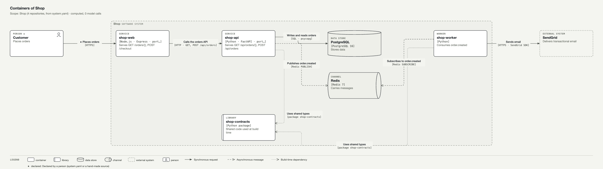

# Prototype: computed Containers view, zero model calls

**Status**: throwaway. The code (`extract.py`, `diagram.py`, `recheck.py`) lives in the session scratchpad,
not in `src/`. These files are its outputs, kept as evidence for the spec.

## What was run

- **Product**: a sandbox of four git repositories built for this test (`shop-web` Node/Express,
  `shop-api` Python/FastAPI, `shop-worker` Python, `shop-contracts` shared types), grouped by
  [`sandbox-system.yaml`](sandbox-system.yaml). No real multi-repo product with a `system.yaml` exists on
  this machine; the sandbox gives a written ground truth ([`ground-truth.md`](ground-truth.md)) to score against.
- **Extraction**: read-only, deterministic, no network, no model.
  - **Reused from Cairn `src/`**: `engines/graph/repos.declarations()`, which gives the packages each repo
    provides and depends on.
  - **New, as the spec proposes (regex passes for the prototype)**:
    - Dockerfile `EXPOSE`/`CMD`, `[project.scripts]` and `package.json` scripts.
    - compose services, images and environment.
    - FastAPI and Express routes, `fetch` calls with the base URL taken from an environment variable.
    - pub/sub calls, including one level of wrapper function.
    - SQL verbs and tables.
    - A data catalog ([`catalog-prototype.json`](catalog-prototype.json)) mapping libraries and images to
      stores, channels and outside services.
- **Rendering and check**: the standard's renderer and checker, reading `docs/diagram-standard/tokens.json`.

## Result



| Ground truth | Computed | Match |
|---|---|---|
| 8 elements (web, api, worker, contracts library, PostgreSQL, Redis, SendGrid, Customer) | 8 elements, same set | 8/8 |
| element kinds | `shop-web` typed **service**, truth says **web app** | 7/8 |
| 8 relationships (incl. 2 build-time to contracts) | 8 relationships, same set, each with what + how | 8/8 |
| relationships not in the truth | none | precision 100% |
| evidence | every element and relationship has at least 1 reference (file:line, manifest or deploy entry) | 100% |
| model calls | 0 | |
| standard check | 0 violations | |

The Customer and its arrow come from `system.yaml` (`actors`, a proposed optional field) and are marked declared.

## Staleness re-check

The `publish("order.created", …)` call was deleted in a copy of `shop-api` and committed, then the model was
re-computed and compared with the stored one ([`containers-rechecked.svg`](containers-rechecked.svg)):

```
STALE shop-api -> Redis 'Publishes order.created': evidence ['shop-api/shop_api/orders.py:12'] no longer found
NEW   shop-api -> Redis 'Stores data'
```

The stale mark is correct. The NEW line is a **false positive**: `events.py` still imports `redis`, so a
library-catalog match on an import alone invented a "stores data" use.

## Lessons carried into the spec

1. **An import is not a use.** Catalog matches need a call site (driver connect, client method, SQL),
   not just an import or a dependency (FR-010 updated).
2. **Web app vs service** cannot be told from routes alone. Signals such as templates, a static or public
   folder, a front-end framework, or `system.yaml` role are needed; until then the kind is marked inferred.
3. **Layout matters as much as facts.** The first auto-layout put the person inside the boundary and crossed
   lines. Ranking by data-flow direction (a subscriber sits after its channel), ordering rows by neighbours,
   and libraries on a bottom row fixed it. The spec asks for a layered, readable layout (FR-024a).
4. **Wrappers hide calls.** Publishing went through a `publish(topic, …)` helper. One level of wrapper
   resolution found it; real code needs the call graph Cairn already builds.
5. **Configuration resolves connections.** `API_BASE_URL=http://api:8000` in compose plus the `fetch(${BASE}…)`
   call pinned shop-web → shop-api without guessing. Only the host is kept, never credentials.
